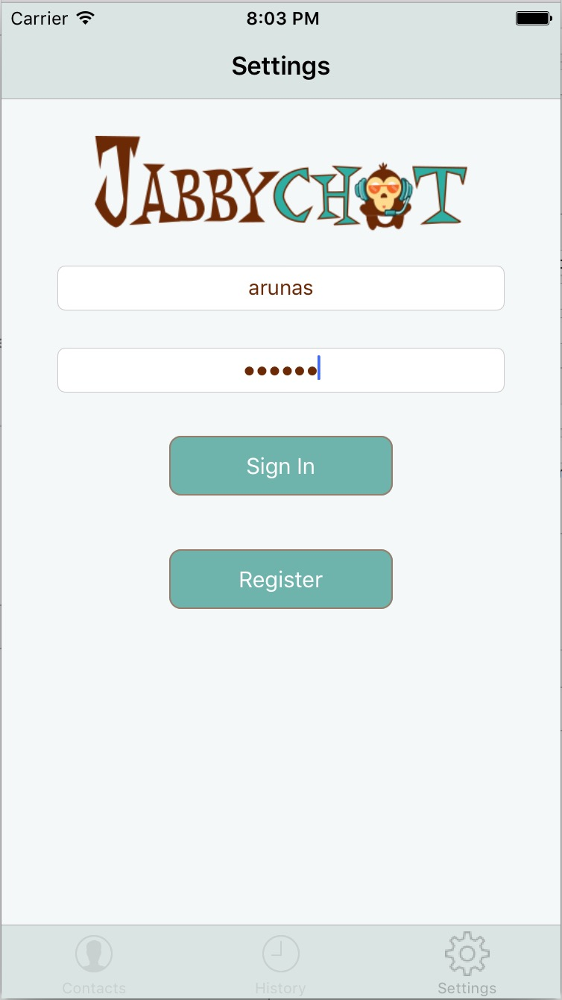
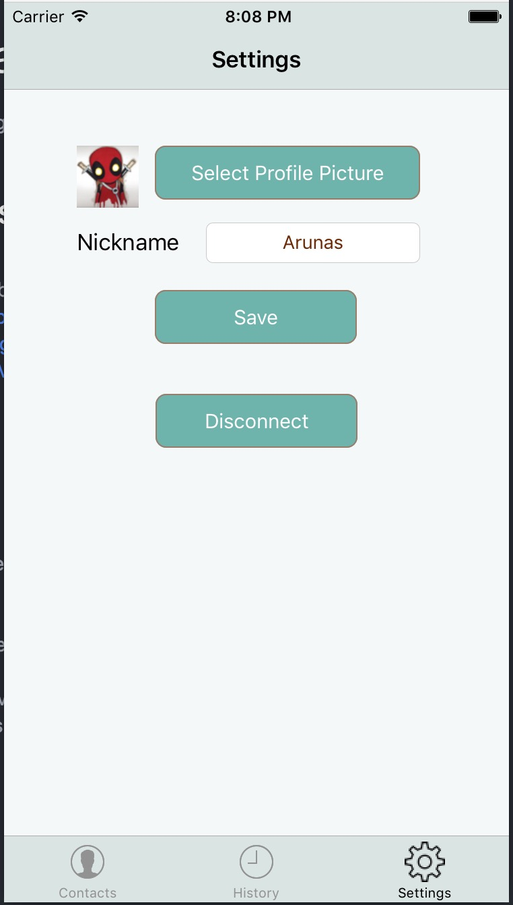
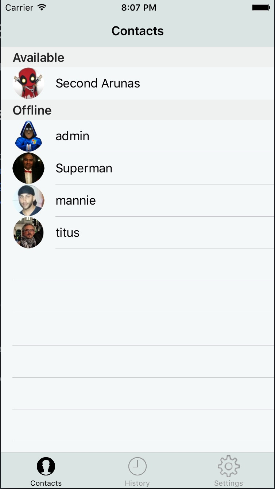
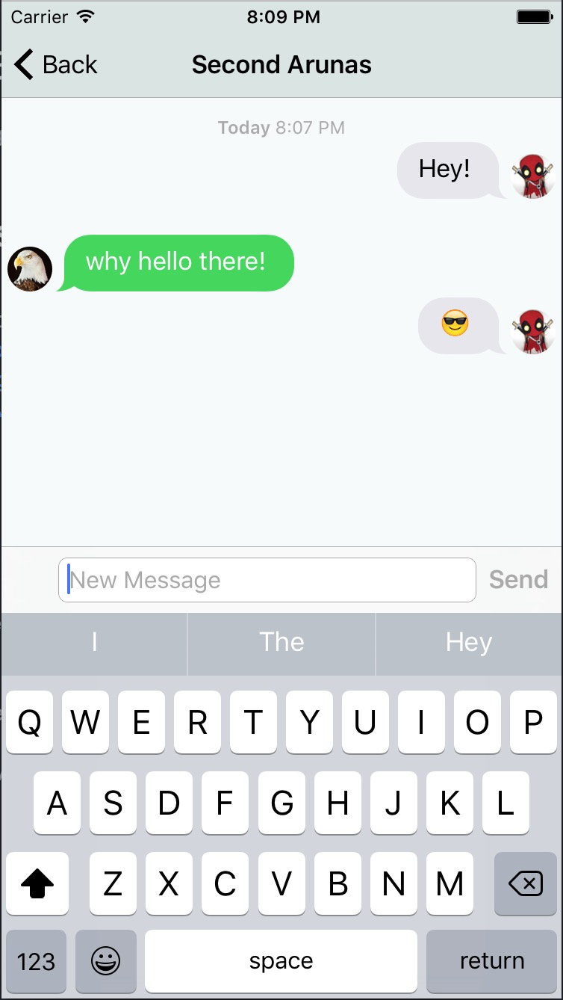

# JabbyChat iOS client

A simple iOS messaging client using the XMPP messaging protocol.

## Technologies used
- [XMPP](https://xmpp.org/)
- [ejabberd](https://www.ejabberd.im/) as a back-end Jabber server
- [XMPPFramework](https://github.com/robbiehanson/XMPPFramework)
- [XMPP Messenger iOS](https://github.com/processone/xmpp-messenger-ios)
- [JSQMessagesViewController](https://github.com/jessesquires/JSQMessagesViewController)
- Swift 2.3
- XCode 7.3.1

## Features
- Login / Register / Logout
- Contacts
- Recent Chats
- Sending / Receiving messages
- Avatars
- Update your avatar / nickname
- Friend's status (Online, Offline, Away)

## Screenshots

